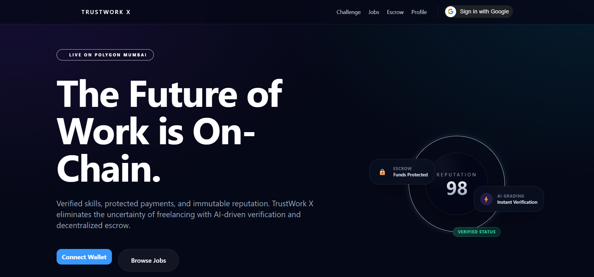
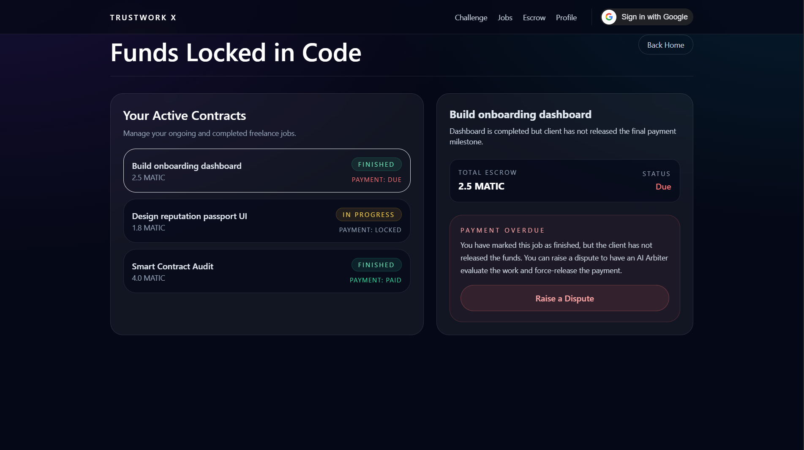
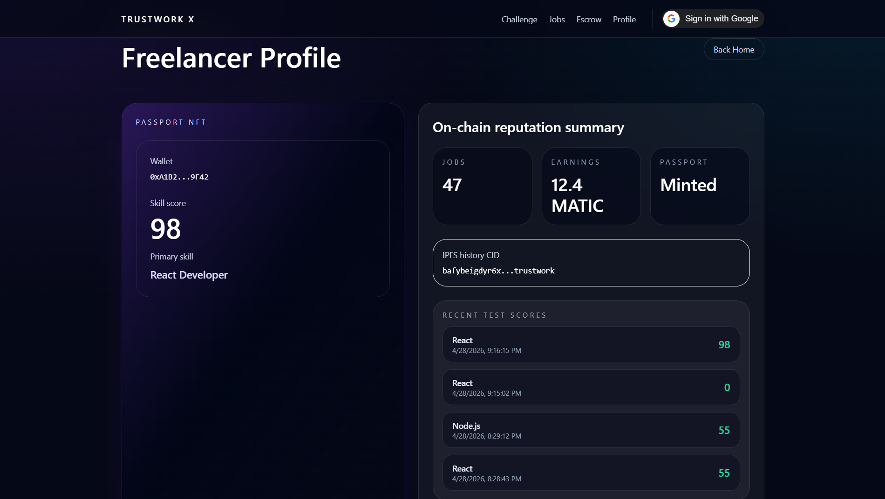
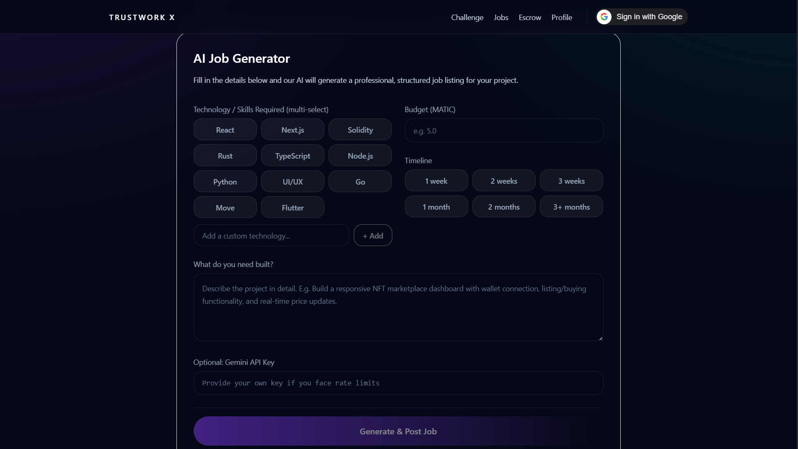

# TrustWork X 🌌



TrustWork X is a decentralized freelance marketplace that combines the security of **Web3 Smart Contracts** with the intelligence of **AI**. It eliminates the uncertainty of freelancing by verifying skills via AI, issuing Soulbound Reputation Passports, and protecting payments with an AI-mediated escrow system.

Built for **HackIndia Spark 7**.

---

## 📸 Platform Interface

### The Job Board
Browse AI-generated, verified job listings and apply using your Soulbound Reputation Passport.


### Secure AI Escrow
Client funds are locked securely on-chain with AI-driven dispute arbitration.


### Profile & Reputation Management
View your minted skills and manage your decentralized identity.


### Seamless Application Flow
Apply to high-quality jobs directly with your verified on-chain score.


### Interactive Dashboard
Switch seamlessly between managing your freelance jobs and client escrow contracts.
#### Freelancer View


#### Client View


---

## 🚀 Key Features

1. **Soulbound Reputation Passports (ERC-5192)**
   - Freelancers take AI-graded skill tests.
   - If they pass (Score ≥ 70), a Soulbound NFT is minted on the Polygon Mumbai network, permanently anchoring their reputation to their wallet.
   - Metadata is securely pinned to IPFS via Pinata.

2. **Smart Contract Escrow**
   - Clients lock funds (MATIC) in the `TrustWorkEscrow` smart contract when posting a job.
   - Funds are securely held until the client approves the work.

3. **AI Dispute Arbitration**
   - If a client refuses to pay, freelancers can trigger a dispute.
   - Google Gemini acts as an impartial Arbiter, reviewing the case and interacting directly with the smart contract to force-release funds if the freelancer was treated unfairly.

4. **Cinematic Web3 UI**
   - Built with Next.js, Framer Motion, and Tailwind CSS.
   - Features premium micro-animations, glassmorphism, and a 3D animated "Reputation Orb".

---

## 🛠️ Tech Stack

- **Frontend**: Next.js (React), Tailwind CSS, Framer Motion, Wagmi (SIWE)
- **Backend**: Express.js, Node.js, Prisma ORM
- **Database**: PostgreSQL (Supabase)
- **Smart Contracts**: Solidity, Hardhat, Ethers.js, Polygon Mumbai Testnet
- **Decentralized Storage**: IPFS (Pinata)
- **AI Integration**: Google Gemini 2.0 / 1.5 Flash (Generative Language API)

---

## 🏃‍♂️ Getting Started

### Prerequisites
- Node.js (v18+)
- A PostgreSQL Database (Supabase recommended)
- API Keys for Pinata, Polygonscan, and Google AI Studio
- A Web3 Wallet (MetaMask) configured for the Polygon Mumbai Testnet.

### Installation

1. **Clone the repository**
   ```bash
   git clone https://github.com/Swastik-Sharma-web/hackindia-spark-7-north-region-inferno.git
   cd hackindia-spark-7-north-region-inferno
   ```

2. **Install Dependencies**
   ```bash
   npm install
   ```

3. **Environment Setup**
   Copy `.env.example` to `.env.local` and fill in your keys:
   ```bash
   cp .env.example .env.local
   ```
   *Make sure to copy `.env.local` to `apps/api/.env` and `apps/web/.env.local` as well.*

4. **Database Setup**
   ```bash
   cd apps/api
   npx prisma db push
   npx prisma generate
   ```

### Running the Application

**Start the Backend API (Port 4000):**
```bash
npm run dev:api
```

**Start the Frontend Web App (Port 3000):**
```bash
npm run dev:web
```

Open `http://localhost:3000` to interact with the platform.

---

## 📝 Smart Contract Deployments

- **Network**: Polygon Mumbai
- **Reputation Passport**: `(Add contract address here)`
- **Escrow Contract**: `(Add contract address here)`

---

*Made with ❤️ for HackIndia.*
